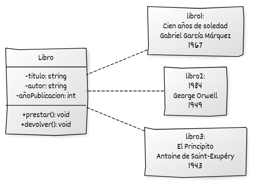
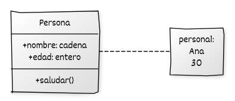

# ¿Qué es la programación orientada a objetos?

La **Programación Orientada a Objetos (POO)** es un paradigma de desarrollo de software que permite **modelar sistemas complejos** mediante la construcción de **objetos**. Cada objeto representa una **entidad del mundo real o conceptual**, y combina **estado** (atributos) y **comportamiento** (métodos).

La POO transforma la manera en que diseñamos y desarrollamos aplicaciones, porque:

* **Aumenta la capacidad de abstracción**, al trabajar con modelos conceptuales en lugar de detalles técnicos inmediatos.
* **Favorece la reutilización, modularidad y mantenibilidad**, permitiendo que el software crezca y se adapte con menor esfuerzo.

## Origen y motivación

La POO surge como respuesta a las limitaciones de paradigmas previos, especialmente de la **programación estructurada**.

En la programación estructurada:

* El código se organiza en **procedimientos y funciones**.
* Los **datos** se gestionan de forma global o mediante parámetros.
* El control del flujo depende de **condicionales y bucles**.

Este enfoque es adecuado en programas pequeños, pero presenta problemas en sistemas grandes:

* **Acoplamiento excesivo** entre datos y funciones.
* **Repetición de código**, por falta de mecanismos de reutilización.
* **Mantenimiento difícil**, al no existir separación clara de responsabilidades.
* **Escalabilidad limitada**, porque el código se vuelve complejo y poco manejable.

La **POO** responde a estas limitaciones integrando **datos y funciones** en una unidad lógica llamada **objeto**. Cada objeto es instancia de una **clase**, y se comporta como un módulo autónomo.


## Ventajas de la POO

* **Modularidad:** el código se organiza en clases independientes, lo que facilita el trabajo en equipo.
* **Reutilización:** una misma clase puede emplearse en distintos programas y contextos.
* **Mantenibilidad:** los cambios en una clase no afectan al resto si se respetan sus interfaces.
* **Abstracción:** permite modelar entidades y relaciones sin necesidad de exponer detalles internos.
* **Escalabilidad:** el sistema puede crecer añadiendo nuevas clases o extendiendo las existentes.
* **Encapsulamiento:** protege el estado interno de un objeto mediante modificadores de acceso, reduciendo errores.


## Conceptos fundamentales

* **Clase:** plantilla que define atributos (estado) y métodos (comportamiento) comunes.
* **Objeto:** instancia concreta de una clase, con valores propios para los atributos.
* **Atributos:** variables que representan el estado interno del objeto.
* **Métodos:** funciones que definen el comportamiento del objeto e interactúan con sus atributos u otros objetos.
* **Mensajes:** la forma en que los objetos se comunican, normalmente mediante la invocación de métodos.


### Ejemplo conceptual: Biblioteca

**Clase:** `Libro`

* **Atributos:** `titulo`, `autor`, `añoPublicacion`
* **Métodos:** `prestar()`, `devolver()`

**Objeto concreto:**

* `titulo`: *Cien años de soledad*
* `autor`: *Gabriel García Márquez*
* `añoPublicacion`: 1967

Cada objeto “libro” comparte la estructura de la clase `Libro`, pero mantiene sus propios valores.


## UML: Lenguaje de Modelado Unificado

El **UML (Unified Modeling Language)** es un estándar para representar sistemas orientados a objetos de forma visual.

El **diagrama de clases** muestra:

* Las clases del sistema.
* Sus atributos y métodos.
* Relaciones entre clases (asociaciones, herencia, dependencias).

Notación básica:

* `+` atributo o método **público**.
* `-` atributo o método **privado**.
* `#` atributo o método **protegido**.


## Representación UML del ejemplo `Libro`




## Ejemplo general 

Veamos un ejemplo en pseudocódigo:

```plaintext
Clase Persona:
    Atributos:
        nombre
        edad
    Métodos:
        saludar()
            Mostrar "Hola, mi nombre es " + nombre
        cumplirAnios()
            edad = edad + 1

// Crear un objeto
persona1 = nueva Persona()
persona1.nombre = "Ana"
persona1.edad = 30

// Usar métodos del objeto
persona1.saludar()        // Resultado: Hola, mi nombre es Ana
persona1.cumplirAnios()
```

Este ejemplo muestra cómo se define una clase con atributos y métodos, cómo se crea un objeto (instancia de la clase) y cómo se utiliza. No está vinculado a un lenguaje específico, lo cual permite entender los principios sin necesidad de saber sintaxis.


## Representación UML del ejemplo `Persona`



Este diagrama indica que `Persona` tiene dos atributos públicos (`nombre` y `edad`) y un método público `saludar()` que no retorna ningún valor.

