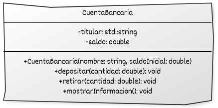

# Encapsulamiento y modificadores de acceso (`public`, `private`, `protected`)

El **encapsulamiento** consiste en ocultar los detalles internos de una clase y exponer únicamente lo necesario para su uso externo. En C++, se logra mediante **modificadores de acceso**, que definen qué partes del programa pueden acceder a los miembros (atributos y métodos) de una clase.

El encapsulamiento permite:

* Proteger el estado interno de modificaciones indebidas.
* Restringir el acceso directo a los atributos.
* Definir una interfaz pública clara.

Ventajas:

* Mayor seguridad en el código.
* Menor acoplamiento entre clases.
* Facilidad para cambiar la implementación sin afectar a los usuarios.

## Modificadores de acceso en C++

* **public**

  * Accesible desde cualquier parte.
  * Define la interfaz pública de la clase.
  * No rompe la encapsulación si se limita a lo necesario.

* **private**

  * Accesible solo dentro de la propia clase.
  * Protege datos internos y mantiene invariantes.
  * Es la opción recomendada para atributos.

* **protected**

  * Accesible dentro de la clase y en sus derivadas.
  * Útil en herencia controlada, no visible para usuarios externos.

Tenemos que tener en cuenta:

* Declarar **atributos como `private` por defecto**.
* Exponer solo lo necesario mediante métodos públicos.
* Asegurar que los métodos mantienen la **invarianza** de la clase (no permitir estados inválidos).


## Ejemplo con encapsulamiento

```cpp
#include <iostream>
#include <string>

class CuentaBancaria {
private:
    std::string titular;
    double saldo;

public:
    CuentaBancaria(const std::string& nombre, double saldoInicial)
        : titular{nombre}, saldo{saldoInicial} {}

    void depositar(double cantidad) {
        if (cantidad > 0) {
            saldo += cantidad;
        }
    }

    void retirar(double cantidad) {
        if (cantidad > 0 && cantidad <= saldo) {
            saldo -= cantidad;
        }
    }

    void mostrarInformacion() const {
        std::cout << "Titular: " << titular
                  << ", Saldo: $" << saldo << "\n";
    }
};

int main() {
    CuentaBancaria cuenta("Luis", 1000.0);
    cuenta.mostrarInformacion();  // Titular: Luis, Saldo: $1000

    cuenta.depositar(250);
    cuenta.retirar(100);
    cuenta.mostrarInformacion();  // Titular: Luis, Saldo: $1150

    // cuenta.saldo = 0; // Error: 'saldo' es privado

    return 0;
}
```

En este ejemplo:

* Los atributos (`titular`, `saldo`) son **privados**.
* Solo se modifican mediante métodos públicos controlados.
* Se garantiza la **invarianza**: el saldo nunca puede ser negativo.
* Se usa **lista de inicialización** en el constructor (C++ moderno).

## Representación UML del ejemplo




## Funciones friend

Una función **friend** no pertenece a la clase, pero puede acceder a sus miembros privados y protegidos. Se usa principalmente cuando:

* Una función no miembro necesita acceso a detalles internos.
* Se sobrecargan operadores como `operator<<` para `std::ostream`.
* Dos clases colaboran estrechamente.

Hay que tener en cuenta:

* Rompe parcialmente el encapsulamiento.
* Debe usarse con moderación.
* No se hereda ni puede ser virtual.

Veamos un ejejmplo:

```cpp
#include <iostream>

class Caja {
private:
    double ancho;

public:
    Caja(double a) : ancho{a} {}

    friend void mostrarAncho(const Caja& c);  //Función amiga
};

void mostrarAncho(const Caja& c) {
    std::cout << "Ancho de la caja: " << c.ancho << '\n'; // Accede a un atributo privado
}

int main() {
    Caja c(3.5);
    mostrarAncho(c);
    return 0;
}
```

