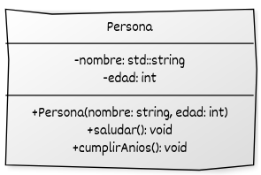

# Clases y objetos

La programación orientada a objetos organiza el código en **objetos** que combinan **estado** (atributos) y **comportamiento** (métodos). En C++, este paradigma se implementa mediante el uso de **clases**.

## ¿Qué es una clase y un objeto?

Una **clase** es una **plantilla** que define:

* **Atributos** (miembros de datos): variables que representan el estado de los objetos.
* **Métodos** (funciones miembro): funciones que representan el comportamiento de los objetos.

Un **objeto** es una **instancia concreta** de una clase.

* Todos los objetos de una clase comparten la misma estructura.
* Cada objeto mantiene sus propios valores para los atributos.

Las clases y objetos permiten:

* Organizar el código en unidades coherentes.
* Favorecer la reutilización y el mantenimiento.
* Ser la base de conceptos más avanzados como encapsulación, herencia y polimorfismo.


Ejemplo básico:

```cpp
#include <iostream>
#include <string>

class Persona {
public:
    // Atributos públicos
    std::string nombre;
    int edad;

    // Método público
    void saludar() {
        std::cout << "Hola, me llamo " << nombre
                  << " y tengo " << edad << " años.\n";
    }
};

int main() {
    Persona p1;
    p1.nombre = "Ana";
    p1.edad = 30;

    Persona p2;
    p2.nombre = "Luis";
    p2.edad = 25;

    p1.saludar();  // Hola, me llamo Ana y tengo 30 años.
    p2.saludar();  // Hola, me llamo Luis y tengo 25 años.

    return 0;
}
```

* `Persona` es una clase con dos atributos (`nombre`, `edad`) y un método (`saludar`).
* `p1` y `p2` son **objetos**, cada uno con su propio estado.


## Ejemplo práctico ampliado

Un ejemplo más completo incluye un **constructor** (para inicializar objetos fácilmente) y métodos adicionales:

```cpp
#include <iostream>
#include <string>

class Persona {
public:
    std::string nombre;
    int edad;

    // Constructor con inicialización uniforme
    Persona(const std::string& n, int e) : nombre{n}, edad{e} {}

    // Método para saludar (no modifica el estado)
    void saludar() const {
        std::cout << "Hola, soy " << nombre
                  << " y tengo " << edad << " años.\n";
    }

    // Método para actualizar la edad
    void cumplirAnios() {
        edad++;
    }
};

int main() {
    Persona p("Claudia", 28);
    p.saludar();       // Hola, soy Claudia y tengo 28 años.
    p.cumplirAnios();
    p.saludar();       // Hola, soy Claudia y tengo 29 años.

    return 0;
}
```

En este ejemplo se aplican conceptos modernos de C++:

* **Inicialización uniforme (`{}`)** en la lista de inicialización del constructor.
* El método `saludar()` está marcado como **`const`**, indicando que no modifica el estado del objeto.


## Representación UML del ejemplo ampliado



