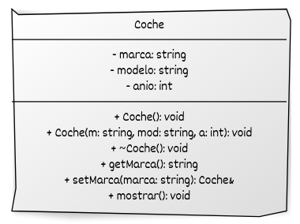

# Métodos y objetos constantes

* Un **método constante** se declara con `const` y garantiza que no modifica el objeto.
* Un **objeto constante** solo puede invocar métodos constantes y no puede modificar sus atributos.

Veamos un ejemplo:

```cpp
#include <iostream>
#include <string>

class Persona {
private:
    std::string nombre;
    int edad;

public:
    // Constructor
    Persona(const std::string& n, int e) : nombre{n}, edad{e} {}

    // Método constante: no modifica el estado del objeto
    void presentarse() const {
        std::cout << "Hola, soy " << nombre << " y tengo " << edad << " años.\n";
    }

    // Método no constante: permite modificar el atributo
    void setNombre(const std::string& nuevoNombre) {
        nombre = nuevoNombre;
    }
};

int main() {
    Persona p1("Carlos", 30);  // Objeto normal
    p1.presentarse();           // OK
    p1.setNombre("Carlos Alberto");
    p1.presentarse();           // Se modificó el nombre

    const Persona p2("Lucía", 25);  // Objeto constante
    p2.presentarse();                // OK: método const
    // p2.setNombre("Ana");          // Error: no se puede modificar un objeto const

    return 0;
}
```

* `presentarse()` está declarada como **const**, por lo que garantiza no modificar los atributos.
* Los objetos **const**, como `p2`, **solo pueden llamar a métodos const**.
* Intentar modificar un atributo o llamar a un método no constante desde un objeto const produce un error de compilación.
* Es una **buena práctica** marcar como `const` todos los métodos que no cambian el estado del objeto, para mejorar la seguridad y la legibilidad del código.

## Ejemplo: constructores, destructores, métodos constantes

```cpp
#include <iostream>
#include <string>

class Coche {
private:
    std::string marca;
    std::string modelo;
    int anio;

public:
    // Constructor por defecto
    Coche() : marca{"Desconocida"}, modelo{"Desconocido"}, anio{0} {}

    // Constructor con parámetros (explicit evita conversiones implícitas)
    explicit Coche(const std::string& m, const std::string& mod, int a)
        : marca{m}, modelo{mod}, anio{a} {}

    // Destructor
    ~Coche() {
        std::cout << "Coche destruido: " << marca << " " << modelo << "\n";
    }

    // Método constante
    std::string getMarca() const {
        return marca;
    }

    // Setter con puntero this y encadenamiento
    Coche& setMarca(const std::string& marca) {
        this->marca = marca;
        return *this;
    }

    // Mostrar información
    void mostrar() const {
        std::cout << "Marca: " << marca
                  << ", Modelo: " << modelo
                  << ", Año: " << anio << "\n";
    }
};

int main() {
    Coche c1{};  // Constructor por defecto
    c1.mostrar();

    Coche c2{"Toyota", "Corolla", 2020};  // Constructor parametrizado
    c2.mostrar();

    c2.setMarca("Honda").mostrar();  // Encadenamiento con this

    const Coche c3{"Ford", "Fiesta", 2018};
    std::cout << "Marca (objeto const): " << c3.getMarca() << "\n";

    return 0;
}
```

## Representación UML del ejemplo




