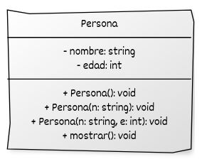

# Constructores, destructores y métodos constantes

En C++, la creación, uso y destrucción de objetos se gestionan mediante **constructores**, **destructores** y **métodos constantes**. Estos mecanismos garantizan que los objetos:

* se **inicialicen correctamente**,
* liberen recursos cuando ya no se necesiten,
* y permitan operaciones seguras en objetos que no deben modificarse.

## Constructores

Un **constructor** es una función especial cuyo nombre coincide con el de la clase y que no tiene tipo de retorno. Se ejecuta automáticamente al crear un objeto.

Tipos:

* **Constructor por defecto:** no recibe argumentos.
* **Constructor parametrizado:** recibe valores para inicializar atributos.
* **Constructor delegante:** llama a otro constructor de la misma clase (se verá más adelante).
* **Constructores especiales:** como el de copia y el de movimiento (se estudiarán más adelante).

Aunque lo estudiaremos en profundidad en el siguiente apartado, hay que indicar que en C++ moderno, se recomienda usar **listas de inicialización uniforme (`{}`)** para inicializar los atributos:

```cpp
#include <iostream>

class Punto {
private:
    int x;
    int y;

public:
    // Constructor por defecto con lista de inicialización
    Punto() : x{0}, y{0} {}

    // Constructor parametrizado con lista de inicialización
    Punto(int valorX, int valorY) : x{valorX}, y{valorY} {}

    // Método constante para mostrar el estado del objeto
    void mostrar() const {
        std::cout << "Punto(" << x << ", " << y << ")\n";
    }
};

int main() {
    Punto p1;            // Se usa el constructor por defecto
    Punto p2{3, 4};      // Se usa el constructor parametrizado

    p1.mostrar();        // Punto(0, 0)
    p2.mostrar();        // Punto(3, 4)

    return 0;
}
```

Este programa demuestra que:

* El **constructor por defecto** inicializa `x` e `y` en `0`.
* El **constructor parametrizado** usa la lista de inicialización para asignar directamente los valores recibidos.
* La función `mostrar()` es **const** porque no modifica el estado del objeto.


### Uso de `explicit`

Si un constructor recibe un único parámetro, puede usarse como conversión implícita, lo que a veces causa errores. Para evitarlo se emplea la palabra clave **`explicit`**:

```cpp
class Entero {
private:
    int valor;

public:
    explicit Entero(int v) : valor{v} {}
};
```

Esto impide hacer:

```cpp
Entero e = 5;   // Error
Entero e(5);    // Correcto
```

## Destructor

Un **destructor** es una función especial que se ejecuta automáticamente cuando un objeto:

* sale de su ámbito,
* se elimina con `delete`,
* o es destruido dentro de un contenedor.

Su sintaxis es:

```cpp
~NombreDeClase();
```

Ejemplo:

```cpp
class Ejemplo {
public:
    ~Ejemplo() {
        std::cout << "Destructor invocado\n";
    }
};
```

Si no se define, el compilador genera uno por defecto. 


## Métodos constantes y objetos constantes

* Un **método constante** se declara con `const` y garantiza que no modifica el objeto.
* Un **objeto constante** solo puede invocar métodos constantes y no puede modificar sus atributos.

```cpp
class Persona {
private:
    std::string nombre;

public:
    Persona(const std::string& n) : nombre{n} {}

    std::string getNombre() const { return nombre; }
};
```

Si declaramos:

```cpp
const Persona p{"Luis"};
p.getNombre();     // Correcto
// p.setNombre("Ana");  // Error
```

Recomendación: **marcar como `const` todos los métodos que no alteren el estado**.


## Uso de `=default` y `=delete`

C++ permite controlar si ciertas funciones especiales (constructores, destructores, operadores, etc.) se deben **generadas automáticamente** (`=default`) o se deben **prohibir explícitamente** (`=delete`).

```cpp
class Ejemplo {
public:
    Ejemplo() = default;               // Constructor por defecto generado automáticamente
    ~Ejemplo() = default;              // Destructor automático
    Ejemplo(const Ejemplo&) = delete;  // Prohíbe la copia
};
```

Esto ofrece un control fino sobre la generación de constructores y destructores.

## Ejemplo final

```cpp
#include <iostream>
#include <string>

class Coche {
private:
    std::string marca;
    std::string modelo;
    int anio;

public:
    // Constructor por defecto
    Coche() : marca{"Desconocida"}, modelo{"Desconocido"}, anio{0} {}

    // Constructor con parámetros (explicit evita conversiones implícitas)
    explicit Coche(const std::string& m, const std::string& mod, int a)
        : marca{m}, modelo{mod}, anio{a} {}

    // Destructor
    ~Coche() {
        std::cout << "Coche destruido: " << marca << " " << modelo << "\n";
    }

    // Método constante
    std::string getMarca() const {
        return marca;
    }

    // Setter con puntero this y encadenamiento
    Coche& setMarca(const std::string& marca) {
        this->marca = marca;
        return *this;
    }

    // Mostrar información
    void mostrar() const {
        std::cout << "Marca: " << marca
                  << ", Modelo: " << modelo
                  << ", Año: " << anio << "\n";
    }
};

int main() {
    Coche c1{};  // Constructor por defecto
    c1.mostrar();

    Coche c2{"Toyota", "Corolla", 2020};  // Constructor parametrizado
    c2.mostrar();

    c2.setMarca("Honda").mostrar();  // Encadenamiento con this

    const Coche c3{"Ford", "Fiesta", 2018};
    std::cout << "Marca (objeto const): " << c3.getMarca() << "\n";

    return 0;
}
```

## Representación UML del ejemplo




