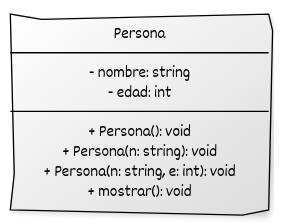

# Inicialización de atributos con listas de inicialización

En C++, los constructores permiten inicializar los atributos de una clase al momento de la creación del objeto. La forma más eficiente y preferida de hacerlo es mediante **listas de inicialización**, que se colocan después de los dos puntos (`:`) y antes del cuerpo del constructor.

La lista de inicialización evita una construcción por defecto seguida de una asignación, realizando en cambio una **construcción directa**. Esto es más eficiente y, en algunos casos, obligatorio.

## Ventajas de las listas de inicialización

* Permiten inicializar miembros `const`.
* Permiten inicializar **referencias**, que deben estar listas al construirse el objeto.
* Evitan construcciones temporales seguidas de asignaciones.
* Son necesarias cuando se usan **tipos sin constructor por defecto**.
* Reflejan mejor la intención de inicializar, no de asignar.

## Ejemplo básico

```cpp
#include <iostream>
#include <string>

class Persona {
private:
    std::string nombre;
    int edad;

public:
    Persona(const std::string& n, int e)
        : nombre{n}, edad{e} {}  // inicialización directa

    void presentarse() const {
        std::cout << "Soy " << nombre << " y tengo " << edad << " años.\n";
    }
};

int main() {
    Persona p{"Ana", 30};
    p.presentarse();  // Soy Ana y tengo 30 años.
    return 0;
}
```

## Casos donde la lista de inicialización es necesaria

### Miembros `const`

Los miembros constantes deben **obligatoriamente** inicializarse en la lista de inicialización, ya que no se pueden asignar dentro del cuerpo del constructor.

```cpp
#include <iostream>

class Punto {
private:
    const double x_;
    const double y_;

public:
    // Constructor con lista de inicialización
    Punto(double x, double y) : x_{x}, y_{y} {}

    // Método constante para mostrar el punto
    void mostrar() const {
        std::cout << "Punto(" << x_ << ", " << y_ << ")\n";
    }
};

int main() {
    Punto p1{1.5, 2.5};   // Se inicializan los miembros const
    Punto p2{0.0, -3.7};

    p1.mostrar();  // Punto(1.5, 2.5)
    p2.mostrar();  // Punto(0, -3.7)

    return 0;
}
```

### Referencias

 Las referencias deben inicializarse en el momento de la construcción. Veamos un ejemplo:

```cpp
#include <iostream>
#include <string>

class Monitor {
private:
    int& referencia;  // Referencia a una variable externa

public:
    Monitor(int& r) : referencia{r} {}

    void mostrarEstado(const std::string& nombre) const {
        std::cout << "Monitor [" << nombre << "]: valor = " << referencia << "\n";
    }

    void modificar(int nuevoValor) {
        referencia = nuevoValor;  // Cambia directamente la variable original
    }
};

int main() {
    int temperatura = 25;
    int presion = 1013;

    Monitor monitorTemp(temperatura);
    Monitor monitorPres(presion);

    monitorTemp.mostrarEstado("Temperatura");
    monitorPres.mostrarEstado("Presión");

    // Cambiar las variables externas afecta al monitor
    temperatura = 30;
    presion = 1008;

    monitorTemp.mostrarEstado("Temperatura");
    monitorPres.mostrarEstado("Presión");

    // Cambiar desde el monitor afecta a las variables externas
    monitorTemp.modificar(35);
    monitorPres.modificar(995);

    monitorTemp.mostrarEstado("Temperatura");
    monitorPres.mostrarEstado("Presión");

    std::cout << "Variable temperatura = " << temperatura << "\n";
    std::cout << "Variable presion = " << presion << "\n";

    return 0;
}
```

* `Monitor` mantiene una **referencia** a una variable externa.
* Si cambias la variable original, el `Monitor` ve el cambio.
* Si cambias desde el `Monitor`, también se actualiza la variable original.


### Tipos sin constructor por defecto

Una razón fundamental para usar listas de inicialización en C++ es cuando se tiene que inicializar un miembro de tipo **sin constructor por defecto**. En estos casos, **no puedes asignarle un valor en el cuerpo del constructor, porque ya debe estar inicializado al entrar al cuerpo**.

Esto ocurre normalmente cuando usamos **composición** (un atributo de una clase es un objeto de otra clase). En este caso, cuando el objeto de la otra clase **no tiene constructor por defecto tenemos que usar la lista de inicialización , ya que El miembro debe estar completamente inicializado antes de ejecutar el cuerpo del constructor**. Ejemplo:

Imaginemos que tenemos una clase `ConexionBD` que representa una conexión a una base de datos y que **necesita obligatoriamente un string de conexión** al construirse. No tiene constructor por defecto, porque no tendría sentido crear una conexión “vacía”.

```cpp
#include <iostream>
#include <string>

class ConexionBD {
private:
    std::string cadenaConexion;

public:
    // Solo existe este constructor: requiere un string
    explicit ConexionBD(const std::string& conexion) : cadenaConexion{conexion} {}

    void conectar() const {
        std::cout << "Conectando a la base de datos en: " << cadenaConexion << "\n";
    }
};

class Aplicacion {
private:
    ConexionBD conexion;  // Composición: la aplicación TIENE una conexión

public:
    // Obligatoriamente inicializamos 'conexion' en la lista
    Aplicacion(const std::string& cadena) : conexion{cadena} {}

    void iniciar() const {
        conexion.conectar();
        std::cout << "Aplicación iniciada.\n";
    }
};

int main() {
    Aplicacion app{"Servidor=127.0.0.1;Puerto=5432;BD=ventas"};
    app.iniciar();

    return 0;
}
```

* `ConexionBD` **no tiene constructor por defecto** (necesita siempre la cadena de conexión).
* En la clase `Aplicacion`, el atributo `conexion` **debe inicializarse en la lista de inicialización** del constructor, porque no podría asignarse después.
* Esto ilustra el caso típico de **composición en C++ moderno**.


## Orden de inicialización

Los atributos se inicializan en el **orden en que se declaran en la clase**, no en el orden de la lista de inicialización. Desordenarlos puede causar advertencias o errores.

```cpp
class Ejemplo {
private:
    int a;
    int b;

public:
    Ejemplo(int x, int y) : b{y}, a{x} {}  // primero se inicializa 'a', luego 'b'
};
```

## Uso combinado con constructores delegantes

Un **constructor delegante** permite que un constructor llame a otro dentro de la misma clase. Esto evita duplicar código y mejora la coherencia en la inicialización.

```cpp
#include <iostream>
#include <string>

class Persona {
private:
    std::string nombre;
    int edad;

public:
    Persona() : Persona("Desconocido", 0) {}   // constructor delegante
    Persona(const std::string& n) : Persona(n, 0) {} // constructor delegante
    Persona(const std::string& n, int e) : nombre{n}, edad{e} {} // inicialización directa

    void mostrar() const {
        std::cout << "Nombre: " << nombre << ", Edad: " << edad << "\n";
    }
};

int main() {
    Persona p1;               // Usa el constructor delegante por defecto
    Persona p2{"José"};       // Usa el constructor delegante con un parámetro
    Persona p3{"María", 25};  // Usa el constructor con dos parámetros

    p1.mostrar();  // Nombre: Desconocido, Edad: 0
    p2.mostrar();  // Nombre: José, Edad: 0
    p3.mostrar();  // Nombre: María, Edad: 25

    return 0;
}
```

## Representación UML del ejemplo Persona

