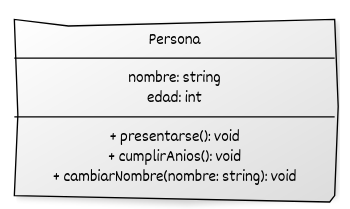

# Miembros de instancia: atributos y métodos

En C++, una clase está compuesta por **miembros**, que se dividen en dos categorías principales:

* **Atributos (miembros de datos):** representan el **estado** de cada objeto.
* **Métodos (funciones miembro):** representan el **comportamiento** que puede realizar ese objeto.

Se llaman *miembros de instancia* porque cada objeto creado a partir de una clase tiene su **propio conjunto de atributos**, pero comparte los **mismos métodos**, que operan sobre su propio estado interno.

Esto permite que:

* Cada objeto tenga un estado independiente.
* Un mismo método actúe de forma diferente según los datos del objeto.
* Se logre la **encapsulación**, uno de los principios básicos de la POO.


## Atributos y métodos

Los **atributos** son variables definidas dentro de una clase; cada objeto tiene su propia copia.
Los **métodos** son funciones miembro que pueden leer o modificar los atributos.

Un método puede recibir **parámetros** y **devolver valores**, igual que cualquier función en C++.
Dependiendo de cómo se pasen y devuelvan los valores, cambian las implicaciones en **rendimiento**, **seguridad** y **mutabilidad**.

Veamos un ejemplo:

```cpp
#include <iostream>
#include <string>

class Persona {
private:
    std::string nombre;
    int edad;

public:
    // Constructor: inicializa los atributos de la clase
    Persona(const std::string& n, int e)
        : nombre(n), edad(e) {}

    // Método que muestra la información del objeto (sin modificarlo)
    void presentarse() const {
        std::cout << "Hola, me llamo " << nombre
                  << " y tengo " << edad << " años.\n";
    }

    // Método que incrementa la edad (paso de parámetro por valor)
    void cumplirAnios(int anios) {
        edad += anios;
    }

    // Método que modifica el nombre (paso por referencia constante)
    void cambiarNombre(const std::string& nuevoNombre) {
        nombre = nuevoNombre;
    }

    // Método que devuelve una copia del nombre (retorno por valor)
    std::string obtenerNombre() const {
        return nombre;
    }

    // Método que devuelve una referencia constante (sin copiar ni modificar)
    const std::string& nombreConstante() const {
        return nombre;
    }
};

int main() {
    Persona p("Ana", 30);

    p.presentarse();                   // Hola, me llamo Ana y tengo 30 años.
    p.cumplirAnios(1);                 // Paso por valor
    p.cambiarNombre("Ana López");      // Paso por referencia constante

    std::string copia = p.obtenerNombre();      // Retorno por valor
    const std::string& ref = p.nombreConstante(); // Retorno por referencia const

    std::cout << "Nombre copiado: " << copia << '\n';
    std::cout << "Referencia const: " << ref << '\n';

    p.presentarse(); // Hola, me llamo Ana López y tengo 31 años.
}
```

* Los **atributos** (`nombre` y `edad`) son privados: solo accesibles desde los métodos de la clase.
* Los **métodos** permiten **leer** y **modificar** esos atributos.
* Se muestran diferentes **formas de paso de parámetros**:
  * Por **valor**: copia del argumento.
  * Por **referencia constante**: sin copia, sin modificar.
  * Aunque no aparece en el ejemplo, también se pueden pasar parámetros por referencias o por punteros.
* También se incluyen diferentes **formas de retorno**:
  * Por **valor**: devuelve una copia del dato.
  * Por **referencia constante**: evita copias innecesarias.
  * Aunque no aparece en el ejemplo, también se pueden devolver valores por referencia.
* Cada objeto (`p`) mantiene su **estado propio**, independiente del de otros objetos.

Hat que tener en cuenta:

* Mantener los **atributos como privados** y proporcionar métodos públicos para acceder o modificarlos si es necesario.
* Usar **referencias constantes (`const &`)** para pasar objetos grandes sin copiarlos cuando no se necesite modificarlos.
* Devolver valores **por referencia constante** cuando quieras evitar copias innecesarias y no sea necesario modificar el dato.
* Definir los métodos como **`const`** cuando no modifiquen el estado del objeto, para mejorar la seguridad y legibilidad del código.

## Acceso implícito y puntero `this`

Dentro de un método, se puede acceder a los atributos de forma implícita (`nombre`) o explícita (`this->nombre`).

El puntero especial **`this`** apunta al objeto actual y se utiliza para:

* Diferenciar entre atributos y parámetros con el mismo nombre.
* Implementar *fluidez de métodos* (cuando un método devuelve `*this`).

Veamos un ejemplo:

```cpp
#include <iostream>
#include <string>

class Persona {
public:
    std::string nombre;
    int edad;

    void presentarse() const {
        std::cout << "Hola, me llamo " << nombre
                  << " y tengo " << edad << " años.\n";
    }

    void cumplirAnios() {
        edad++;
    }

    void cambiarNombre(const std::string& nombre) {
        this->nombre = nombre; // Diferencia entre parámetro y atributo
    }
};

int main() {
    Persona p;
    p.nombre = "Carlos";
    p.edad = 40;

    p.presentarse();       // Hola, me llamo Carlos y tengo 40 años.
    p.cumplirAnios();
    p.cambiarNombre("Carlos Alberto");
    p.presentarse();       // Hola, me llamo Carlos Alberto y tengo 41 años.
}
```

Veamos la representación UML del ejemplo `Persona`:



