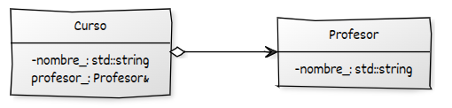
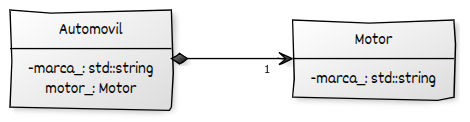

# Agregación y Composición

En la programación orientada a objetos, uno de los pilares fundamentales es la capacidad de modelar relaciones entre clases. Entre estas relaciones se encuentran **agregación** y **composición**, ambas formas de establecer relaciones **tiene un** (has-a) entre objetos. Aunque similares en estructura, su diferencia principal radica en la **fuerte dependencia del ciclo de vida** de los objetos involucrados.

Comprender estas dos formas de asociación permite diseñar sistemas más robustos, con una distribución clara de responsabilidades y una correcta gestión de recursos.

## Agregación

La **agregación** representa una relación entre objetos en la que una clase contiene o utiliza instancias de otras clases, pero **no es propietaria** de ellas. Esto significa que el objeto agregado **puede existir independientemente** del objeto que lo agrega. Las características son:

* Representa una **relación débil** entre clases (comparada con la composición).
* **No implica propiedad exclusiva**: el objeto contenido puede estar vinculado a varios objetos contenedores.
* El objeto agregado **puede ser compartido** por varios objetos agregadores.
* El **ciclo de vida del objeto agregado no depende** del ciclo de vida del objeto que lo contiene.
* Es común en relaciones de tipo “uno a muchos”, “muchos a muchos” o “todo a parte”.
* Se utiliza típicamente cuando un objeto actúa como **contenedor o colección** de otros objetos, sin asumir responsabilidad sobre su existencia.

Veamos un ejemplo:

```cpp
#include <iostream>
#include <string>

class Profesor {
public:
    Profesor(std::string nombre) : nombre_(nombre) {}
    void mostrar() const { std::cout << "Profesor: " << nombre_ << '\n'; }

private:
    std::string nombre_;
};

class Curso {
public:
    Curso(std::string nombre, const Profesor& profesor)
        : nombre_(nombre), profesor_(profesor) {}

    void mostrar() const {
        std::cout << "Curso: " << nombre_ << '\n';
        profesor_.mostrar(); // usa el profesor pero no lo posee
    }

private:
    std::string nombre_;
    const Profesor& profesor_; // referencia (no ownership)
};
```

En este ejemplo, un `Curso` tiene una referencia a un `Profesor`, pero no es responsable de su creación ni destrucción. El mismo `Profesor` puede estar asociado a varios cursos, o seguir existiendo si un curso se elimina.

Diagrama UML:



* Se muestra con una **línea con diamante blanco** en el lado del objeto agregador (contenedor) y una flecha apuntando hacia el objeto agregado (componente).
* El **diamante indica la agregación**, pero no propiedad.
* Se representan relaciones **entre clases**, no entre instancias concretas.
* La notación puede incluir **multiplicidad** en los extremos (ej. `1`, `0..*`), aunque puede omitirse si el contexto es claro.


## Composición

La composición implica una relación más fuerte en la que una clase **posee** instancias de otras clases y es responsable directa de su creación y destrucción. El objeto compuesto **no puede existir sin su contenedor**. Las características son:

* Representa una relación fuerte.
* Implica propiedad exclusiva.
* El objeto compuesto **forma parte integral** del objeto contenedor.
* El ciclo de vida del objeto compuesto **depende** del contenedor.

Veamos un ejemplo:

```cpp
#include <iostream>
#include <string>

class Motor {
public:
    Motor(std::string tipo) : tipo_(tipo) {}
    void encender() const { std::cout << "Motor " << tipo_ << " encendido.\n"; }

private:
    std::string tipo_;
};

class Automovil {
public:
    Automovil(std::string marca) : marca_(marca), motor_("Gasolina") {}

    void arrancar() const {
        std::cout << "Automóvil " << marca_ << " arrancando...\n";
        motor_.encender(); // motor es parte del automóvil
    }

private:
    std::string marca_;
    Motor motor_; // composición: motor es creado y destruido junto al automóvil
};
```

En este caso, el `Automovil` posee un `Motor`. El `Motor` no tiene sentido sin su `Automovil` y es destruido automáticamente cuando el `Automovil` es destruido.

Diagrama UML:



* Se muestra con una **línea con diamante negro** en el lado del objeto contenedor, y una flecha apuntando hacia el objeto contenido.
* El **diamante negro indica composición**, es decir, propiedad exclusiva y dependencia de ciclo de vida.
* La relación se establece entre **clases**, no entre objetos concretos.
* Se puede incluir **multiplicidad** en los extremos (como `1`, `0..1`, `1..*`, etc.), aunque puede omitirse si el contexto es evidente.


## Buenas prácticas

* Utiliza **composición** cuando el objeto contenido **forma parte esencial** del objeto principal y su existencia no tiene sentido sin él.
* Utiliza **agregación** cuando los objetos involucrados **tienen vidas independientes** y pueden existir sin relación directa.
* La composición promueve el principio de **alta cohesión** y es preferible en muchos contextos por su claridad y encapsulación.
* Cuidado con los **punteros crudos** en agregación: considera usar `std::shared_ptr` o `std::weak_ptr` cuando sea apropiado.


## Ejercicio propuesto

Modelar una clase `Computadora` que contenga un `Procesador` y una `Pantalla`. El `Procesador` debe ser parte integral de la computadora (composición), mientras que la `Pantalla` puede ser compartida entre varias computadoras (agregación).

* La clase `Computadora` debe **poseer un `Procesador`** (composición).
* La clase `Computadora` debe **usar una `Pantalla` compartida** (agregación).
* Deben demostrarse la relación de dependencia en el ciclo de vida (el procesador muere con la computadora, pero la pantalla puede vivir aparte).


```cpp
#include <iostream>
#include <memory>
#include <string>

// Clase Procesador (Composición)
class Procesador {
public:
    Procesador(std::string modelo) : modelo_(modelo) {
        std::cout << "Procesador " << modelo_ << " construido.\n";
    }

    ~Procesador() {
        std::cout << "Procesador " << modelo_ << " destruido.\n";
    }

    void info() const {
        std::cout << "Procesador: " << modelo_ << '\n';
    }

private:
    std::string modelo_;
};

// Clase Pantalla (Agregación)
class Pantalla {
public:
    Pantalla(std::string tipo) : tipo_(tipo) {
        std::cout << "Pantalla " << tipo_ << " construida.\n";
    }

    ~Pantalla() {
        std::cout << "Pantalla " << tipo_ << " destruida.\n";
    }

    void mostrar() const {
        std::cout << "Pantalla: " << tipo_ << '\n';
    }

private:
    std::string tipo_;
};

// Clase Computadora (compone Procesador y agrega Pantalla)
class Computadora {
public:
    Computadora(std::string marca, std::string modeloProcesador, std::shared_ptr<Pantalla> pantalla)
        : marca_(marca), procesador_(modeloProcesador), pantalla_(pantalla) {
        std::cout << "Computadora " << marca_ << " construida.\n";
    }

    ~Computadora() {
        std::cout << "Computadora " << marca_ << " destruida.\n";
    }

    void mostrarComponentes() const {
        std::cout << "Computadora: " << marca_ << '\n';
        procesador_.info();          // parte de la composición
        pantalla_->mostrar();        // parte agregada (compartida)
    }

private:
    std::string marca_;
    Procesador procesador_;             // composición: creado y destruido junto a Computadora
    std::shared_ptr<Pantalla> pantalla_; // agregación: compartido, gestionado por fuera
};
```

---

### Uso y demostración

```cpp
int main() {
    std::shared_ptr<Pantalla> pantallaCompartida = std::make_shared<Pantalla>("LED 24''");

    {
        Computadora pc1("Dell", "Intel i7", pantallaCompartida);
        Computadora pc2("HP", "AMD Ryzen 5", pantallaCompartida);

        std::cout << "\nComponentes de PC1:\n";
        pc1.mostrarComponentes();

        std::cout << "\nComponentes de PC2:\n";
        pc2.mostrarComponentes();
    } // pc1 y pc2 se destruyen, pero pantalla sigue viva hasta que el shared_ptr muere

    std::cout << "Fin del programa.\n";
    return 0;
}
```

---

### Salida esperada (resumida)

```
Pantalla LED 24'' construida.
Procesador Intel i7 construido.
Computadora Dell construida.
Procesador AMD Ryzen 5 construido.
Computadora HP construida.

Componentes de PC1:
Computadora: Dell
Procesador: Intel i7
Pantalla: LED 24''

Componentes de PC2:
Computadora: HP
Procesador: AMD Ryzen 5
Pantalla: LED 24''

Computadora HP destruida.
Procesador AMD Ryzen 5 destruido.
Computadora Dell destruida.
Procesador Intel i7 destruido.
Pantalla LED 24'' destruida.
Fin del programa.
```

---

### Conclusión

Este ejemplo permite observar claramente:

* Cómo los objetos de tipo `Procesador` son **parte integral** de la clase `Computadora` (composición): viven y mueren con ella.
* Cómo una `Pantalla` puede ser **compartida** entre múltiples instancias de `Computadora` (agregación), y su ciclo de vida es **gestionado externamente** mediante `std::shared_ptr`.

¿Te gustaría que continúe con el siguiente punto: **Asociaciones entre objetos y responsabilidades**?
