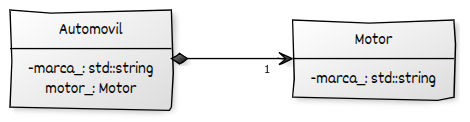

# Composición entre clases

La **composición** es un tipo fuerte de asociación en programación orientada a objetos que representa una relación de **propiedad exclusiva** entre dos clases. En esta relación, una clase (denominada *compuesta* o *contenedora*) **posee completamente** a otra clase (denominada *componente*), siendo responsable directa tanto de su creación como de su destrucción.

Características principales:

* El objeto contenido **no puede existir independientemente** del objeto que lo contiene.
* La destrucción del objeto contenedor implica la destrucción automática y completa de los objetos contenidos.
* La composición modela relaciones “parte-todo” estrictas, donde la parte no tiene sentido fuera del todo.
* Es una relación estructural fuerte que implica un ciclo de vida dependiente.

Ejemplo típico: un automóvil **contiene un motor propio**; si el automóvil desaparece, su motor también deja de existir.

## Formas de implementar la composición en C++ moderno

En C++ moderno, la composición se implementa comúnmente usando **miembros por valor** o **punteros inteligentes propietarios** para garantizar el control total sobre el ciclo de vida del objeto contenido.

### Composición por valor

El objeto contenido se declara como un miembro de datos dentro de la clase contenedora. Su construcción y destrucción ocurren automáticamente con el ciclo de vida del objeto contenedor.

```cpp
class Motor {
public:
    void arrancar() const {
        std::cout << "Motor arrancado.\n";
    }
};

class Vehiculo {
private:
    Motor motor_;  // composición por valor
public:
    Vehiculo() = default;

    void encender() const {
        motor_.arrancar();
    }
};
```

**Ventajas:**

* Control total y seguro del ciclo de vida.
* Sin punteros ni riesgos de memoria.
* Implementación sencilla.

**Desventajas:**

* El objeto contenido siempre existe mientras exista el contenedor.
* No permite compartir el objeto contenido.

### Composición con punteros inteligentes propietarios (`std::unique_ptr`)

Cuando la composición requiere que el objeto contenido sea creado dinámicamente o inicializado con parámetros específicos, se puede usar un `std::unique_ptr` para asegurar la propiedad exclusiva y la destrucción automática.

```cpp
#include <memory>

class Motor {
public:
    void arrancar() const {
        std::cout << "Motor arrancado.\n";
    }
};

class Vehiculo {
private:
    std::unique_ptr<Motor> motor_;  // propietario exclusivo
public:
    Vehiculo() : motor_(std::make_unique<Motor>()) {}

    void encender() const {
        motor_->arrancar();
    }
};
```

**Ventajas:**

* Permite inicialización dinámica.
* Mantiene propiedad exclusiva y gestión automática.
* Seguridad ante fugas de memoria.

**Desventajas:**

* Ligera sobrecarga por gestión dinámica.
* No permite compartir el objeto contenido (como sí lo haría `shared_ptr`).

## Ejemplo completo de composición: Vehículo y Motor

Presentamos un ejemplo completo que ilustra la composición por valor, usando un `Motor` contenido dentro de un `Vehiculo`.

```cpp
#include <iostream>
#include <string>

// Clase Motor
class Motor {
private:
    std::string tipo_;
public:
    Motor(const std::string& tipo) : tipo_(tipo) {}

    void arrancar() const {
        std::cout << "Motor tipo " << tipo_ << " arrancado.\n";
    }
};

// Clase Vehiculo que contiene un Motor (composición)
class Vehiculo {
private:
    Motor motor_;  // composición: motor es parte integral del vehículo
    std::string modelo_;
public:
    Vehiculo(const std::string& modelo, const std::string& tipoMotor)
        : modelo_(modelo), motor_(tipoMotor) {}

    void encender() const {
        std::cout << "Vehículo modelo " << modelo_ << " arrancando motor...\n";
        motor_.arrancar();
    }
};

int main() {
    Vehiculo auto1("Sedán", "Gasolina");

    auto1.encender();

    // El motor existe y es controlado exclusivamente por el vehículo
    // No puede existir sin el vehículo

    return 0;
}
```

* La clase `Vehiculo` contiene un objeto `Motor` como miembro por valor.
* El `Motor` se crea junto con el vehículo y se destruye automáticamente al destruir el vehículo.
* Esta relación representa claramente una **composición**, porque el motor no existe sin el vehículo.
* El método `encender` accede directamente al motor para arrancarlo, mostrando la colaboración fuerte entre ambos.
* No hay punteros ni gestión manual, lo que elimina riesgos de fugas o punteros colgantes.

## Diagrama UML:



* Se muestra con una **línea con diamante negro** en el lado del objeto contenedor, y una flecha apuntando hacia el objeto contenido.
* El **diamante negro indica composición**, es decir, propiedad exclusiva y dependencia de ciclo de vida.
* La relación se establece entre **clases**, no entre objetos concretos.
* Se puede incluir **multiplicidad** en los extremos (como `1`, `0..1`, `1..*`, etc.), aunque puede omitirse si el contexto es evidente.