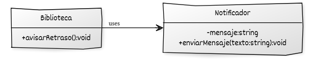
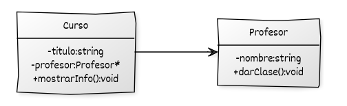
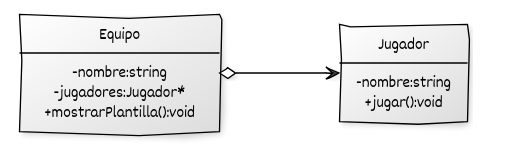
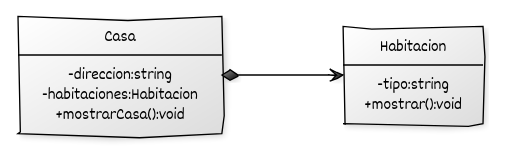

# Ejercicios sobre relaciones de clases

## Ejercicio 1: Dependencia (Biblioteca y Notificador)

En una biblioteca pública quieren implementar un sistema que avise a los socios cuando se retrasan en devolver un libro. La biblioteca no se encarga directamente de enviar mensajes, sino que utiliza un servicio externo de notificaciones.

Crea las clases:

* `Notificador`, que tiene un atributo `mensaje` y un método `enviarMensaje(const std::string&)`.
* `Biblioteca`, que tiene un método `avisarRetraso()` que construye un mensaje y lo envía usando un objeto `Notificador`.

Observa que la biblioteca no necesita almacenar un `Notificador` como atributo, solo lo utiliza dentro de su método: esta es la esencia de la **dependencia**.

## Ejercicio 2: Asociación (Profesor y Curso)

En una universidad, cada curso está dirigido por un profesor. El profesor existe independientemente del curso (puede impartir varios en distintos años), pero cada curso necesita tener asignado un profesor responsable.

Crea las clases:

* `Profesor`, con un atributo `nombre` y un método `darClase()`.
* `Curso`, con un atributo `titulo` y un puntero a un `Profesor`.

El curso mantiene una referencia a su profesor, pero no es dueño de él: esta es una **asociación unidireccional**.

## Ejercicio 3: Agregación (Equipo y Jugador)

Un club deportivo necesita organizar sus equipos. Cada jugador puede pertenecer a varios equipos, y un equipo puede estar formado por distintos jugadores. Si un equipo desaparece, los jugadores siguen existiendo y pueden integrarse en otros.

Crea las clases:

* `Jugador`, con un atributo `nombre` y un método `jugar()`.
* `Equipo`, con un atributo `nombre` y una lista de punteros a `Jugador`.

La relación es una **agregación**: el equipo conoce y utiliza a sus jugadores, pero no es dueño de ellos.

## Ejercicio 4: Composición (Habitación y Casa)

Una inmobiliaria quiere representar casas y sus habitaciones. Cada casa está formada por varias habitaciones, que no tienen sentido fuera de ella: si la casa se destruye, también lo hacen sus habitaciones.

Crea las clases:

* `Habitacion`, con un atributo `tipo` y un método `mostrar()`.
* `Casa`, con un atributo `direccion` y un vector de `Habitacion` como parte integral.

Esta es una **composición**, porque la vida de las habitaciones depende por completo de la casa.

