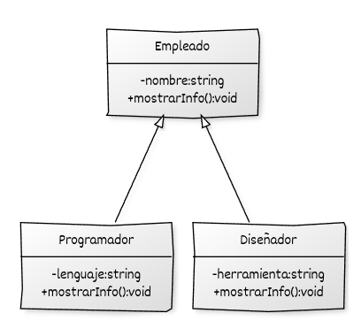
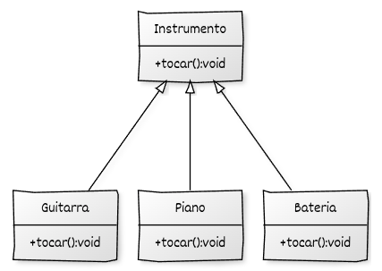
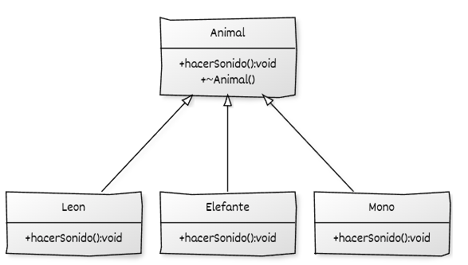

# Ejercicios sobre herencia y polimorfismo

## Ejercicio 1: Herencia básica

En una empresa, todos los empleados tienen un nombre y un método para mostrarlo. Los programadores, además, tienen un lenguaje principal, y los diseñadores, un programa de diseño favorito.

Crea las clases:

* `Empleado`, con atributo `nombre` y método `mostrarInfo()`.
* `Programador`, derivada de `Empleado`, con atributo `lenguaje` y método `mostrarInfo()`.
* `Disenador`, derivada de `Empleado`, con atributo `herramienta` y método `mostrarInfo()`.

Usa herencia para evitar duplicar el código relacionado con el nombre.

### UML

## Ejercicio 2: Polimorfismo dinámico

Queremos simular diferentes tipos de **instrumentos musicales**. Todos tienen un método `tocar()`, pero cada instrumento produce un sonido distinto.

Crea las clases:

* `Instrumento` (clase base abstracta), con método virtual puro `tocar()`.
* `Guitarra`, derivada de `Instrumento`, redefine `tocar()` para imprimir "Rasgueando la guitarra".
* `Piano`, derivada de `Instrumento`, redefine `tocar()` para imprimir "Tocando el piano".
* `Bateria`, derivada de `Instrumento`, redefine `tocar()` para imprimir "Golpeando la batería".

Escribe un programa que use un `std::vector<std::unique_ptr<Instrumento>>` para almacenar distintos instrumentos y llame a `tocar()` en cada uno, demostrando el polimorfismo dinámico.

### UML

## Ejercicio 3: Conversión implícita y punteros base

En un zoológico queremos representar distintos animales, pero tratarlos de forma uniforme mediante **referencias a la clase base**.
Esto permitirá demostrar el funcionamiento de las **conversiones implícitas** en jerarquías de herencia y el **polimorfismo dinámico** en C++.

Crea las clases:

* **Animal** (clase base)

  * Contiene un método virtual `hacerSonido()` que imprime `"Sonido genérico de animal"`.
  * Incluye un destructor virtual.

* **Leon** (derivada de `Animal`)

  * Redefine `hacerSonido()` para imprimir `"Ruge el león"`.
  * Añade el método `cazar()`, que imprime `"El león está cazando"`.

* **Elefante** (derivada de `Animal`)

  * Redefine `hacerSonido()` para imprimir `"Barrita el elefante"`.
  * Añade el método `banarse()`, que imprime `"El elefante se baña"`.

* **Mono** (derivada de `Animal`)

  * No redefine `hacerSonido()`, por lo que hereda el comportamiento genérico de `Animal`.
  * Añade el método `columpiarse()`, que imprime `"El mono se columpia"`.

En el programa principal (`main`):

1. Crea instancias de las clases derivadas.
2. Declara referencias de tipo `Animal&` y asígnales los objetos derivados, demostrando la **conversión implícita de referencias derivadas a base**.
3. Llama al método `hacerSonido()` a través de las referencias base para observar el comportamiento **polimórfico**:

   * Si el método está sobrescrito, se ejecuta la versión de la clase derivada.
   * Si no lo está, se utiliza la versión de la clase base.
4. Comprueba que **no es posible acceder a los métodos específicos de cada clase derivada** (`cazar()`, `banarse()`, `columpiarse()`) desde una referencia a la base, salvo mediante una **conversión explícita**.

### UML

