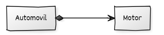
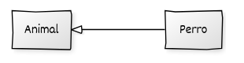
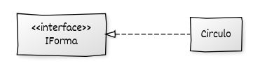

# Introducción a las relaciones entre clases

En la programación orientada a objetos, las clases no actúan de forma aislada. A medida que un sistema crece en complejidad, se hace necesario modelar cómo **colaboran e interactúan** entre sí. Esta colaboración se expresa mediante diferentes tipos de **relaciones**, cada una con un propósito y un nivel distinto de acoplamiento.

Estas relaciones permiten organizar el diseño del sistema, clarificar responsabilidades, favorecer la reutilización de código y sentar las bases para aplicar técnicas más avanzadas como los **patrones de diseño**.

A continuación se presentan las principales relaciones entre clases, desde las más simples y temporales hasta las más estructurales y duraderas.

## Dependencia

* Representa una relación temporal y débil.
* Una clase **usa a otra de forma puntual** para realizar una acción.
* No implica que la clase dependiente almacene a la otra en su estado interno.

Ejemplo: un método de la clase `Impresora` recibe un objeto `Documento` como parámetro para imprimirlo.

## Asociación

* Relación más estable que la dependencia.
* Una clase almacena una referencia a otra clase.
* Puede ser:

  * Unidireccional: solo una clase conoce a la otra.
  * Bidireccional: ambas clases se conocen mutuamente.

Ejemplo: un `Pedido` tiene un `Cliente`.

## Agregación

* Tipo especial de asociación.
* Una clase utiliza a otra, pero **no la posee**.
* El objeto agregado puede existir independientemente del agregador.

Ejemplo: un `Curso` tiene un `Profesor`, pero el profesor existe fuera del curso.

## Composición

* Asociación fuerte en la que una clase posee completamente a otra.
* El objeto contenido **no puede existir sin su contenedor**.

Ejemplo: un `Automóvil` contiene un `Motor`; si el automóvil se destruye, también lo hace el motor.

## Herencia (generalización)

* Relación jerárquica donde una clase derivada hereda atributos y métodos de una clase base.
* Se utiliza para modelar relaciones del tipo “es-un”.

Ejemplo: un `Perro` es un `Animal`.

## Realización

* Relación entre una clase concreta y una interfaz o clase abstracta.
* Indica que la clase implementa el comportamiento definido por otra.
* Fundamental para la programación orientada a interfaces.

Ejemplo: Este diagrama indica que Circulo realiza la interfaz IForma, es decir, implementa los métodos definidos en ella.

