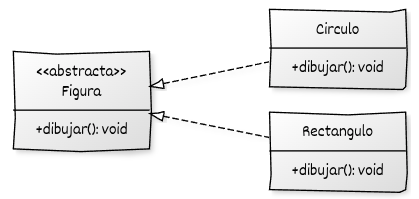

# Clases abstractas y métodos virtuales puros

## Introducción al diseño orientado a interfaces

En apartados anteriores se estudió el **polimorfismo dinámico**, que permite que un mismo método se comporte de manera diferente según el tipo real del objeto.
En esta sección profundizaremos en el **diseño polimórfico orientado a interfaces**, un enfoque que aprovecha el polimorfismo para desacoplar la definición de un comportamiento (*qué se hace*) de su implementación concreta (*cómo se hace*).

El objetivo es aprender a **definir contratos abstractos** que las clases concretas deben cumplir, garantizando coherencia y extensibilidad del sistema sin comprometer la seguridad o la claridad del código.


## Clases abstractas

En la programación orientada a objetos, una **clase abstracta** define una interfaz común que describe un conjunto de operaciones que las clases derivadas deben implementar.
Se utiliza para **representar conceptos generales** que no tienen sentido por sí solos, sino únicamente a través de sus especializaciones.

Las clases abstractas se basan en el uso de **métodos virtuales puros**, que actúan como **contratos** que las subclases concretas deben cumplir.
Este mecanismo es la base del **diseño polimórfico**, permitiendo escribir código que trabaje con distintos tipos de objetos de manera uniforme, sin conocer su tipo concreto.

Una **clase abstracta** en C++ se caracteriza por contener al menos una **función miembro virtual pura**, declarada con el sufijo `= 0`.
La presencia de este tipo de función convierte automáticamente a la clase en **no instanciable**.

Veamos un  ejemplo, donde se define una jerarquía de clases que representan figuras geométricas. Cada figura puede dibujarse, pero la manera concreta en que se realiza esa acción depende del tipo de figura.

```cpp
#include <iostream>
#include <memory>
#include <vector>

// Clase base abstracta
class Figura {
protected:
    std::string color;

public:
    Figura(const std::string& c = "negro") : color(c) {}

    virtual void dibujar() const = 0;  // Método virtual puro
    virtual ~Figura() = default;

    void mostrarColor() const {
        std::cout << "Color: " << color << "\n";
    }
};

// Clases derivadas concretas
class Circulo : public Figura {
public:
    using Figura::Figura;  // Hereda constructor

    void dibujar() const override {
        std::cout << "Dibujando un círculo (" << color << ")\n";
    }
};

class Rectangulo : public Figura {
public:
    using Figura::Figura;

    void dibujar() const override {
        std::cout << "Dibujando un rectángulo (" << color << ")\n";
    }
};

int main() {
    std::vector<std::unique_ptr<Figura>> figuras;

    figuras.push_back(std::make_unique<Circulo>("rojo"));
    figuras.push_back(std::make_unique<Rectangulo>("azul"));

    for (const auto& figura : figuras) {
        figura->dibujar();      // Llamada polimórfica
        figura->mostrarColor(); // Método común a todas las figuras
    }
}

```
* La clase `Figura` **no proporciona una implementación concreta** del método `dibujar()`.
  Declara este método como **virtual puro** (`= 0`), lo que convierte a `Figura` en una **clase abstracta**.
  Por tanto, **no puede instanciarse directamente** y sirve como **interfaz común** para todas las figuras que deriven de ella.
* Cualquier clase derivada de `Figura` está **obligada** a implementar el método `dibujar()` para poder ser instanciada.
  Las clases `Circulo` y `Rectangulo` redefinen el método usando la palabra clave `override`, que indica que se trata de una **redefinición polimórfica** y permite al compilador verificar que la firma coincide exactamente con la de la clase base.
* Si una clase derivada **no implementa todos los métodos virtuales puros** que hereda, **también se considera abstracta**, y no podrá instanciarse directamente.
* El **destructor virtual** en `Figura` (`virtual ~Figura() = default;`) es **imprescindible en jerarquías polimórficas**.
  Garantiza que, al destruir un objeto a través de un puntero a la clase base (`Figura*`), se invoque correctamente el destructor del tipo derivado correspondiente (`Circulo`, `Rectangulo`, etc.).
  De no ser virtual, la destrucción sería incompleta y podría producir **fugas de memoria o recursos**.
* En el programa, los objetos se gestionan mediante **punteros inteligentes** (`std::unique_ptr<Figura>`), que automatizan la gestión de memoria.
  Gracias al principio **RAII** (*Resource Acquisition Is Initialization*), los recursos dinámicos se liberan de forma automática al salir de ámbito, sin necesidad de liberar memoria manualmente.
* El contenedor `std::vector<std::unique_ptr<Figura>>` puede almacenar **objetos de distintos tipos derivados** (`Circulo`, `Rectangulo`, etc.) porque todos ellos comparten la misma interfaz base `Figura`.
  En el bucle, la llamada `figura->dibujar()` se **resuelve dinámicamente en tiempo de ejecución**, según el **tipo real** del objeto apuntado, lo que ejemplifica el uso del **polimorfismo dinámico** en C++ moderno.


## UML




En el siguiente apartado analizaremos cómo **una clase abstracta que solo contiene métodos virtuales puros** se convierte en una **interfaz pura**, utilizada para definir contratos de comportamiento totalmente desacoplados de su implementación.

